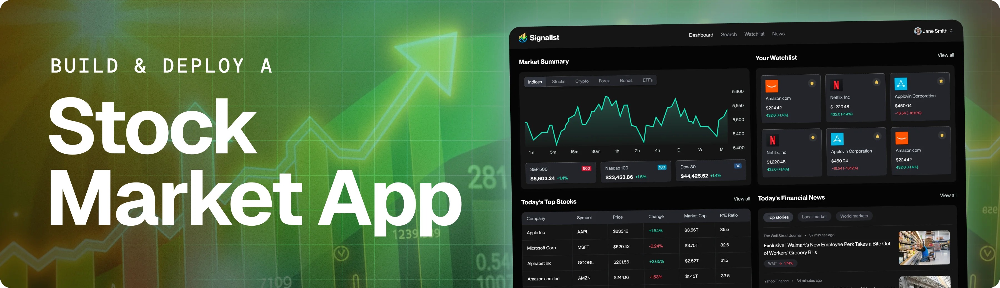

<div align="center">
  <br />
    <a href="" target="_blank">
      
    </a>
  <br />

  <div>
    
    
          
  </div>

  <h3 align="center">Project Title Here</h3>

   <div align="center">
     Build this project step by step with our detailed tutorial on <a href="https://www.youtube.com/watch?v=XUkNR-JfHwo" target="_blank"><b>JavaScript Mastery</b></a> YouTube. Join the JSM family!
    </div>
</div>

## 📋 <a name="table">Table of Contents</a>

1. ✨ [Introduction](#introduction)
2. ⚙️ [Tech Stack](#tech-stack)
3. 🔋 [Features](#features)
4. 🤸 [Quick Start](#quick-start)
5. 🔗 [Assets](#links)
6. 🚀 [More](#more)

## 🚨 Tutorial

This repository contains the code corresponding to an in-depth tutorial available on our YouTube channel, <a href="https://www.youtube.com/@javascriptmastery/videos" target="_blank"><b>JavaScript Mastery</b></a>.

If you prefer visual learning, this is the perfect resource for you. Follow our tutorial to learn how to build projects like these step-by-step in a beginner-friendly manner!

<a href="" target="_blank"></a>

## <a name="introduction">✨ Introduction</a>

AI-powered Nike-style eCommerce built with Devin AI, Next.js, Drizzle ORM, and Better Auth! Devin generates your product pages, cart, and checkout flows—powered by Stripe payments and a PostgreSQL (Neon) backend. Featuring a clean, modular UI and tools tailored for devs who want to ship fast.

If you're getting started and need assistance or face any bugs, join our active Discord community with over **50k+** members. It's a place where people help each other out.

<a href="https://discord.com/invite/n6EdbFJ" target="_blank"></a>

## <a name="tech-stack">⚙️ Tech Stack</a>

- **[Better Auth](https://www.better-auth.com/)** is a framework-agnostic authentication and authorization library for TypeScript. It provides built-in support for email and password authentication, social sign-on (Google, GitHub, Apple, and more), and multi-factor authentication, simplifying user authentication and account management.

- **[Devin AI](https://docs.devin.ai/get-started/devin-intro)** is an autonomous AI software engineer by Cognition Labs that independently plans, writes, debugs, and deploys full applications from natural language prompts. It integrates with tools like Slack, Linear, and Jira to manage tasks and pull requests, and learns new technologies on the fly by reading documentation.


- **[Drizzle ORM](https://orm.drizzle.team/docs/overview)** is a lightweight and performant TypeScript ORM designed with developer experience in mind. It provides a seamless interface between application code and database operations while maintaining high performance and reliability.

- **[Neon](https://neon.com/)** is a fully managed, serverless PostgreSQL database platform. It offers features like instant provisioning, autoscaling, and database branching, enabling developers to build scalable applications without managing infrastructure.

- **[Next.js](https://nextjs.org/docs)** is a powerful React framework for building full-stack web applications. It simplifies development with features like server-side rendering, static site generation, and API routes, enabling developers to focus on building products and shipping quickly.

- **[PostgreSQL](https://www.postgresql.org/)** is a powerful, open-source relational database system known for its reliability, data integrity, and robust feature set. It supports advanced data types, full ACID compliance, and extensibility, making it suitable for a wide range of applications.

- **[Stripe](https://stripe.com/)** is a payment gateway that enables businesses to accept, process, and manage various payment methods, such as credit cards, debit cards, and digital wallets, in a secure and efficient manner. It simplifies the payment process for developers and businesses alike.

- **[TypeScript](https://www.typescriptlang.org/)** is a superset of JavaScript that adds static typing, providing better tooling, code quality, and error detection for developers. It is ideal for building large-scale applications and enhances the development experience.

- **[Zustand](https://zustand-demo.pmnd.rs)** is a minimal, hook-based state management library for React. It lets you manage global state with zero boilerplate, no context providers, and excellent performance through selective state subscriptions.


## <a name="features">🔋 Features</a>

👉 **Landing Page**: A fast, engaging homepage that introduces your brand and products with smooth animations and clear calls to action.

👉 **Product Listing Page**: Browse all products with filters, sorting, and real-time availability—powered by Devin AI-generated content for dynamic updates.

👉 **Auth Pages**: Secure and seamless user signup, login, and password recovery using Better Auth, ensuring smooth access without backend hassles.

👉 **Product Details Page**: Detailed product info, images, and reviews with AI-enhanced descriptions to help customers make confident buying decisions.

👉 **Cart Page**: Intuitive cart management allowing users to add, remove, and update quantities, with instant price recalculations and persistent state via Zustand.

👉 **Order Page**: Track order history and status with reliable data stored in PostgreSQL (Neon), plus secure payments handled by Stripe integration.

And many more, including code architecture and reusability.

## <a name="quick-start">🤸 Quick Start</a>

Follow these steps to set up the project locally on your machine.

**Prerequisites**

Make sure you have the following installed on your machine:

- [Git](https://git-scm.com/)
- [Node.js](https://nodejs.org/en)
- [npm](https://www.npmjs.com/) (Node Package Manager)

**Cloning the Repository**

```bash
git clone 
cd 
```

**Installation**

Install the project dependencies using npm:

```bash
npm install
```
**Set Up Environment Variables**

Create a new file named `.env` in the root of your project and add the following content:

```env

```

Replace the placeholder values with your actual ImageKit, NeonDB, Upstash, and Resend credentials. You can obtain these credentials by signing up on: [**Example**](https://jsm.dev/example).


**Running the Project**

```bash
npm run dev
```

Open [http://localhost:3000](http://localhost:3000) in your browser to view the project.

## <a name="links">🔗 Assets</a>

Assets and snippets used in the project can be found in the **[video kit]()**.

<a href="" target="_blank">
  
</a>

## <a name="more">🚀 More</a>

**Advance your skills with Next.js Pro Course**

Enjoyed creating this project? Dive deeper into our PRO courses for a richer learning adventure. They're packed with
detailed explanations, cool features, and exercises to boost your skills. Give it a go!

<a href="" target="_blank">
  
</a>
# stock-market-app_next
